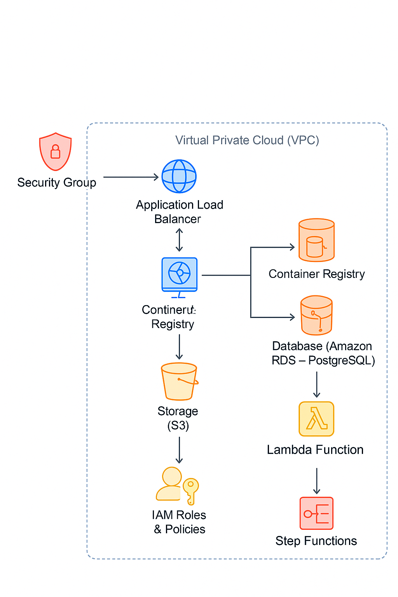

# 🛒 AWS Grocery App Deployment Guide using Terraform

Welcome! This repository contains the infrastructure deployment guide for **GroceryMate**, a cloud-native e-commerce platform for online grocery shopping.  
Built as part of the **Masterschool Data Science Bootcamp** — Cloud Engineering Track.

Our goal: **Fully automated AWS infrastructure deployment** using **Terraform** and **GitHub Actions**.

---

## 📚 Table of Contents
1. 🚀 [Introduction](#-introduction)
2. 🏗️ [Infrastructure Overview](#-infrastructure-overview)
3. 🧩 [Architecture & Diagrams](#-architecture--diagrams)
4. ⚙️ [Terraform Configuration](#-terraform-configuration)
5. 🏢 [Infrastructure Components](#-infrastructure-components)
    - 🔒 [Security Groups](#-security-groups)
    - ☁️ [Virtual Private Cloud (VPC)](#-virtual-private-cloud-vpc)
    - 🌐 [Application Load Balancer (ALB)](#-application-load-balancer-alb)
    - 🖥️ [Compute Infrastructure (EC2 & Auto Scaling Group)](#-compute-infrastructure-ec2--auto-scaling-group)
    - 📦 [Container Registry (ECR)](#-container-registry-ecr)
    - 🛢️ [Database (Amazon RDS - PostgreSQL)](#-database-amazon-rds---postgresql)
    - 🗄️ [Storage (S3 Bucket)](#-storage-s3-bucket)
    - 🛡️ [IAM Roles & Policies](#-iam-roles--policies)
    - 🔄 [Lambda Function & Step Functions](#-lambda-function--step-functions)
6. 🧮 [Variables](#-variables)
7. 🛠️ [Terraform Execution Flow](#-terraform-execution-flow)
8. 📝 [Notes](#-notes)
9. 🤝 [Contributing](#-contributing)
10. 📜 [License](#-license)

---

## 🚀 Introduction

**GroceryMate** is a cloud-native e-commerce app built for a seamless online grocery experience.
This project, developed as part of the **Cloud Track Engineering** in Masterschool’s **Data Science Bootcamp**, extends an original app by our mentor **Alejandro Román** — special thanks!

**The challenge:** deploy its AWS infrastructure, step-by-step.
**The solution:** full automation with Terraform and GitHub Actions — scalable, repeatable, and 100% hands-off.

This repository focuses on the AWS architecture, deployment pipeline, and automation.
For application features and local setup instructions, refer to the original README.md.

---

## 🏗️ Infrastructure Overview

This modularized Terraform configuration provisions the infrastructure for a grocery web application using AWS. 
The setup includes:
* An auto-scalable high-available Multi-AZ EC2 environment running Dockerized applications.
* A secure PostgreSQL database on RDS with Failover Replica in private subnets.
* A Multi_AZ Application Load Balancer for traffic distribution.
* An S3 bucket for storing user avatars and database dumps.

The infrastructure is designed for high availability, scalability, and security.


---

## 🧩 Architecture & Diagrams



---

## ⚙️ Terraform Configuration

Infrastructure as Code (IaC) is implemented using **Terraform** for declarative, scalable deployments.  
GitHub Actions automate the CI/CD pipeline for infrastructure provisioning.

Here is the structure of the Terraform project:

``` /bootstrap
├── main.tf
├── variables.tf
/infrastructure
├── modules
│ ├── alb
│ ├── asg
│ ├── ec2_launch_template
│ ├── iam_ec2
│ ├── iam_lambda
│ ├── lambda
│ ├── rds
│ ├── s3_bucket
│ ├── security_groups
│ └── vpc
├── main.tf
├── variables.tf
├── outputs.tf
├── terraform.tfvars
├── lambda_data
└── generate_backend.py
```
---

## 🏢 Infrastructure Components

### 🔒 Security Groups
Configuration of security rules for EC2 instances, ALB, and RDS.

* ALB security group allows ports 80 and 443.
* EC2 security group allows SSH from a specific IP and ALB traffic over port 5000.
* RDS security group allows access only from EC2 instances.
* Lambda security allows outbound connection to RDS instance

### ☁️ Virtual Private Cloud (VPC)
Network isolation with public and private subnets across multiple availability zones.

* Subnets: 3 Public (for ALB, EC2) & 3 Private (for RDS).
* Internet Gateway: Provides internet access to public subnets.
* Route Table: Configured for public subnets routing.
* VPC Endpoint Gateway: Provides access to S3 bucket over AWS network.

### 🌐 Application Load Balancer (ALB)
Traffic distribution across auto-scaled EC2 instances.

### 🖥️ Compute Infrastructure (EC2 & Auto Scaling Group)
Auto-scalable EC2 setup for high availability and resilience.

* Auto Scaling Group (ASG):
  * Uses a Launch Template with user_data for EC2 configuration.
  * Deploys EC2 instances in public subnets.
  * Scaling Settings(adjustable as needed):
* Docker Deployment:  🐳
  * EC2 instances pull docker image from ECR.
  * Container start automatically.

### 📦 Container Registry (ECR)

* Stores the Docker image of the application.
* EC2 instances pull the latest image during launching from the template.

### 🛢️ Database (Amazon RDS - PostgreSQL)
Managed relational database service for reliable data storage.

* Instance Type: db.t3.micro (free-tier eligible).
* Multi-AZ Deployment: Enabled.
* Security: Deployed in a private subnet with restricted access.

### 🗄️ Storage (S3 Bucket)
Static file hosting and backup storage.

* Purpose: Stores user avatar images, db_dump and layer files
* Configuration:
  * Bucket Name: Set via Terraform variables. 
  * Versioning: Disabled. 
  * Lifecycle Policy: Disabled. 
  * Public Access Control:
    * Block Public ACLs: Disabled. 
    * Block Public Policy: Disabled. 
  * Preloaded Avatar: ```user_default.png``` is uploaded. 
  * Preloaded db_dump file: ```sqlite_dump_clean.sql``` is uploaded 
  * Preloaded lambda_layer file: ```boto3-psycopg2-layer.zip``` is uploaded

### 🛡️ IAM Roles & Policies
Role-based access control to AWS resources with least-privilege permissions.

* EC2 Role: Allows pulling images from ECR and accessing S3.
* Lambda Role: Allows accessing S3, describing RDS, managing network.
* Step Functions Role: Grants permissions to interact with RDS, S3, and Lambda.
* S3 Role: Allows EC2 to access 'avatar' folder and Lambda 'db_dump' folder


### 🔄 Lambda Function & Step Functions
Serverless functions for asynchronous workflows.

* Purpose: Ensures the database is populated once the infrastructure is ready.
* Step Functions:
  * Monitors RDS availability. 
  * Waits for the database dump file to be uploaded to S3. 
  * Triggers the Lambda function when conditions are met.
* Lambda Function:
  * Retrieves the SQL dump file from S3. 
  * Connects to RDS. 
  * Executes the SQL commands to populate the database.
* CloudWatch Logs:
  * Logs execution of Step Functions and Lambda. 
  * Enables debugging of potential issues.
*EventBridge Trigger:
  * Detects new database dump uploads in S3 Bucket and triggers Step Functions.

---

## 🧮 Variables

All configurations are parameterized using `variables.tf` for flexibility and environment-specific deployments.

The following variables are defined in the `variables.tf` file:

| Variable        | Description                          | Type   | Default           |
|-----------------|--------------------------------------|--------|-------------------|
| `instance_name` | Name of the EC2 instance             | string | —                 |
| `instance_type` | EC2 instance type                    | string | `t2.micro`        |
| `key_pair_name` | Name of the existing AWS Key Pair    | string | —                 |
| `aws_region`    | AWS region to deploy resources       | string | —                 |
| `profile`       | AWS named CLI profile                | string | —                 |
| `ami`           | AMI ID to use for the EC2 instance   | string | `ami-02b7d5b1e55a7b5f1` |
| `my_ip`         | Your public IP address in CIDR notation | string | —                 |

> ℹ️ **Note:** Variables with no default are required to be provided via `terraform.tfvars` or the CLI.

---

## 🛠️ Terraform Execution Flow

1. Initialize Terraform: `terraform init`
2. Validate configuration: `terraform validate`
3. Plan deployment: `terraform plan`
4. Apply deployment: `terraform apply`
5. Destroy the infrastructure (if needed) : `terraform destroy -auto-approve`
---

## 📝 Notes

- Ensure your AWS credentials are properly configured before running Terraform.
- The infrastructure follows the **well-architected framework** best practices.

## 🤝 Contributing

We welcome contributions! Please follow these steps:

1. Fork the repository.
2. Create a new feature branch (`feature/your-feature`).
3. Implement your changes and commit them.
4. Push your branch and create a pull request.

## 📜 License

This project is licensed under the MIT License.


